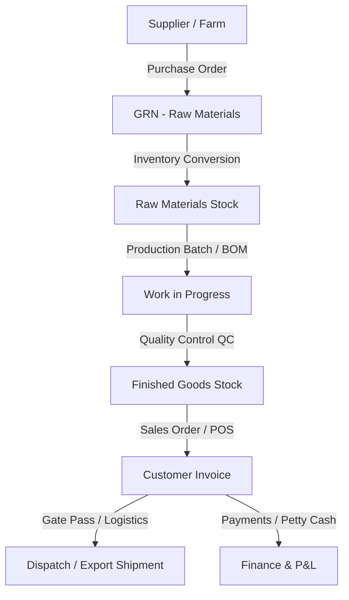

# Authentic Lanka Exports ERP
## Comprehensive Customer User Manual

Welcome to the **Authentic Lanka Exports ERP (Manufacturing & Distribution)** system. This user manual provides a comprehensive, end-to-end guide to navigating and operating the ERP. 

---

## Table of Contents
1. [System Overview & Architecture](#1-system-overview--architecture)
2. [Login, Credentials & Security Controls](#2-login-credentials--security-controls)
3. [User Roles & Access Permissions Matrix](#3-user-roles--access-permissions-matrix)
4. [Product Master (Catalog Management)](#4-product-master-catalog-management)
5. [Procurement & Supply (GRN & Purchases)](#5-procurement--supply-grn--purchases)
6. [Manufacturing & MES (Production, BOM, Costing & Forecasting)](#6-manufacturing--mes-production-bom-costing--forecasting)
7. [Sales, CRM, POS & Customer Returns (RMA)](#7-sales-crm-pos--customer-returns-rma)
8. [Logistics, Export Shipments & Gate Pass Management](#8-logistics-export-shipments--gate-pass-management)
9. [Finance, Bank Accounts & Petty Cash Ledger](#9-finance-bank-accounts--petty-cash-ledger)
10. [HR, Roster Shifts & Payroll Engine](#10-hr-roster-shifts--payroll-engine)
11. [System Administration (Audit Logs, Imports & Settings)](#11-system-administration-audit-logs-imports--settings)

---

## 1. System Overview & Architecture

The Authentic Lanka Exports ERP is an integrated system designed to manage manufacturing, inventory, sales, procurement, payments, logistics, and human resources in a single centralized platform. 

### Data Flow Overview
Data flows seamlessly across modules to prevent human errors and discrepancy:


### Technology Highlights
* **Real-Time Data**: Driven by a React-Vite frontend and Express-Node backend, using Socket.io to push real-time updates (e.g., immediate stock reductions and active alerts) across all open user terminals.
* **Audit Trail**: Every modification is recorded in the system audit log, tracking the employee ID, exact timestamp, module, action type, and before/after values.

---

## 2. Login, Credentials & Security Controls

Every employee must authenticate using their assigned credentials.

### Default Developer/Testing Credentials
For initial verification, the database is seeded with a default **Administrator** account:
* **Email Address**: `admin@example.com`
* **Default Password**: `Admin123!`
* **Access Level**: Full Access (Admin)

### Login Security Policies
1. **Password Visibility**: Click the **Eye icon** on the right side of the password field to show/hide the characters.
2. **Failed Login Attempts Counter**: You are allowed up to **5 failed attempts**. If the login fails, the system shows: *"Invalid email or password. X attempt(s) remaining."*
3. **Account Lockout**: After 5 failed attempts, the account is locked for **15 minutes** to prevent brute-force attacks. The screen will display: *"Account locked due to too many failed attempts. Try again in 15 minutes."*
4. **Deactivated Users**: Inactive accounts are blocked. The screen will display: *"Account is deactivated. Contact admin."*

---

## 3. User Roles & Access Permissions Matrix

The ERP uses **Role-Based Access Control (RBAC)** to ensure data security. 

### Core Roles Overview
* **Admin / Super Admin**: Complete access, user registration, role configuration, database backup, system settings, and audit log tracking.
* **Warehouse Manager**: Full catalog, categories, brands, warehouse allocations, stock transfers, adjustments, and supplier returns.
* **Warehouse Staff**: View stock, log GRNs, perform transfers, and record damage sheets.
* **Production Staff**: Manage Bills of Materials (BOM), production runs (batches), raw material consumption, utility draws, and output entry.
* **Sales Manager**: Approve sales orders, set credit overrides, POS setups, invoices, returns, and reports.
* **Sales Rep**: Log customer sales orders, use POS terminals, check prices, collect payments.
* **Accountant**: Manage customer invoices, supplier bills, payments ledger, bank accounts, cheque clearances, and Daily P&L.
* **Cashier**: Access POS terminal, process retail sales, collect payments.
* **HR Manager**: Manage employee directory, designations, shifts, attendance, holiday calendars, salary rules, and payroll execution.
* **Employee**: General user account for self-service attendance logging, leave requests, and payslip downloads.

---

## 4. Product Master (Catalog Management)

The **Product Master** contains all items tracked in your supply chain. Items belong to one of four categories:
1. **Raw Materials**: Unprocessed raw items (e.g., green leaves, raw coconut, spices).
2. **Semi-Finished Goods**: Dehydrated, milled, or intermediate stocks awaiting packaging.
3. **Finished Goods**: Trade-ready packages ready for commercial dispatches.
4. **Packaging Materials**: Cardboard boxes, bottles, seals, and wraps.

### Product Code Generation Schema
To maintain consistency, the system generates unique product codes automatically based on category selection using a **Julian Date** scheme:

$$\text{Format: } P - [\text{CategoryShortCode}] - [\text{YearShort}][\text{JulianDayOfYear}] - [\text{SequenceNo}]$$

* **CategoryShortCode**: 3-letter capital identifier (e.g., Raw Materials = `RAW`, Finished Goods = `FNG`, Packaging = `PKG`, Mechanical = `MAC`).
* **YearShort**: Tailoring 2 digits of the active calendar year (e.g., `2026` becomes `26`).
* **JulianDayOfYear**: Three-digit calendar day of the year (001 to 365/366). E.g., June 4th is `155`.
* **SequenceNo**: A 2-digit counter starting at `01` that resets daily per category.

*Example*: **`P-RAW-26155-03`** represents the 3rd raw material registered in the system on June 4th, 2026.

---

## 5. Procurement & Supply (GRN & Purchases)

This module handles supplier/farm partnerships and inbound inventory tracking.

### Step-by-Step Purchasing Workflow:
1. **Create Purchase Order (PO)**: Go to **Procurement ➔ Purchase Orders ➔ Create PO**. Select a Supplier, set delivery dates, select warehouse location, input product items, unit costs, and click **Submit**.
2. **Goods Receipt Note (GRN)**: When goods arrive at the gate, go to **Procurement ➔ Goods Receipt Notes ➔ Receive Goods**.
3. **Inspection & Rejection Logic**: The inspector enters the total quantity delivered and the rejected quantity. The system automatically calculates the accepted amount:

$$\text{Accepted Quantity} = \text{Received Quantity} - \text{Rejected Quantity}$$

4. **Yield Forecasting**: If a recipe conversion rule exists for the product, the GRN screen shows a **Live Yield Forecast** calculating the expected manufactured weight.
5. **Perishables & Expiry**: Log the Supplier Invoice #, Supplier Delivery Note #, transport vehicle number, driver name, and product expiry dates. Click **Confirm Receipt** to update warehouse stock.
6. **Supplier Bills**: Confirmed GRNs generate draft **Supplier Bills** in the Finance tab for the Accountant's review and payout scheduling.

---

## 6. Manufacturing & MES (Production, BOM, Costing & Forecasting)

This module operates your factory floor, tracking ingredient conversions, workforce headcount, utilities, and quality releases.

### A. Bill of Materials (BOM) Costing Formula
Before production starts, a recipe (BOM) must be defined. The system auto-calculates unit costs by factoring in wastage allowances, labor, and overhead:

$$\text{BOM Cost} = \sum \left( \text{Qty} \times \left(1 + \frac{\text{Wastage}\%}{100}\right) \times \text{Unit Cost} \right) + \text{Labor Cost} + \text{Overhead Cost}$$

* **Wastage %**: Anticipated processing shrinkage or moisture loss.
* **Labor Cost**: Total shift hours multiplied by the standard hourly rate.
* **Overhead Cost**: Machine depreciation and utility constants.

### B. Logging a Production Batch
1. Go to **Production ➔ Production Batches ➔ Log New Batch**.
2. Select the target product, raw material supplier (for traceabilities), and the **Process Template** (e.g. Washing ➔ Dehydration ➔ Milling ➔ Sifting ➔ Packing).
3. **Workforce Allocation**: Log the staff count split by **Day Shift** and **Night Shift**.
4. **Utility & Raw Material Log**: Input raw material weights (Kg), active drying hours, **Firewood Consumed (Kg)**, and **Electricity Units (kWh)**.
5. **Output Entry**: Record the final manufactured weight (Kg).
6. **Batch Efficiency Formula**: Upon submitting the output weight, the system computes processing performance:

$$\text{Batch Efficiency}\% = \left( \frac{\text{Total Output Weight}}{\text{Total Input Weight}} \right) \times 100$$

### C. Quality Control (QC) Clearance
Once marked complete, the batch status is updated to **Pending QC**. It moves to the **QC Queue** where a Quality Officer must enter laboratory parameters (e.g., moisture %, purity %, micro-counts) and click **Approve Batch**. Only approved batches are released into trade-ready warehouse inventories.

### D. Production Forecasting Engine
The ERP includes predictive analytics for production scheduling:
* **Linear Regression Trend**: Plots past run indexes ($x$) against output efficiency percentages ($y$). The least-squares formulas ($y = mx + c$) forecast subsequent yields:

$$m = \frac{N\sum(xy) - \sum x\sum y}{N\sum(x^2) - (\sum x)^2}$$

$$c = \frac{\sum y - m\sum x}{N}$$

* **Moving Average**: Evaluates the average efficiency across the last 5 completed batches.
* **Utility Rates**: Projects fuel requirements based on consumption coefficients:

$$\text{Firewood Rate} = \frac{\text{Firewood Consumed (Kg)}}{\text{Total Input Weight (Kg)}}$$

$$\text{Electricity Rate} = \frac{\text{Electricity Consumed (kWh)}}{\text{Total Input Weight (Kg)}}$$

---

## 7. Sales, CRM, POS & Customer Returns (RMA)

This module handles downstream commercial pipelines.

### A. Sales Pipeline Workflow
```
Sales Inquiry ➔ Quotation ➔ Sales Order (SO) ➔ Invoice ➔ Dispatch
```
1. **Sales Inquiry**: Track potential client requests.
2. **Quotation**: Generate price quotes with custom discounts.
3. **Sales Order (SO)**: Convert quotes to orders. If a client exceeds their credit limit, a Sales Manager or Admin must authenticate to override the block.
4. **Point of Sale (POS)**: Cashiers use the retail checkout screen to process immediate over-the-counter sales, select items, compute 18% VAT, and print receipts.

### B. Customer Returns & RMA (Return Merchandise Authorization)
When a customer returns goods:
1. Navigate to **Sales ➔ Customer Returns ➔ Log Return**.
2. The system assigns a unique **RMA-XXX** tracking reference.
3. **Inspection Details**: Log the return reason, condition (Restockable vs. Damaged), and disposition (Discard, Repair, or Return to Warehouse).
4. **Restocking Fees**: Enter restocking charges (if applicable). The refund amount is computed automatically:

$$\text{Refund Amount} = \text{Returned Items Value} - \text{Restocking Fee}$$

5. Upon approval, items are added back to stock (if restockable) and a **Credit Note** is generated in Finance.

---

## 8. Logistics, Export Shipments & Gate Pass Management

Tracks transportation assets and international shipping requirements.

### A. Export Shipments & Logistics
For export orders, navigate to **Logistics ➔ Export Logistics ➔ Track Shipment**:
* **Tracking Metadata**: Enter Vessel Name, Voyage Number, Bill of Lading (B/L) number, Port of Loading, Port of Discharge, ETD (Estimated Time of Departure), and ETA (Estimated Time of Arrival).
* **Live Tracking**: Paste the carrier tracking URL to click and track container locations.
* **CIF Cost Calculation**: The system automatically aggregates values to output the Cost, Insurance, and Freight (CIF) value:

$$\text{CIF Value} = \text{FOB Product Value} + \text{Freight Cost} + \text{Insurance Premium}$$

### B. Security Gate Pass Management
To prevent stock theft, no delivery truck can exit the factory without a **Gate Pass**:
1. Go to **Logistics ➔ Gate Pass Management ➔ Generate Gate Pass**.
2. Select the source Invoice / Transfer Order.
3. Log the transport vehicle license number, driver name, helper name, container seal number, and detailed product breakdown.
4. The security officer at the gate verifies the physical truck against the digital Gate Pass and marks it **Checked Out**.

---

## 9. Finance, Bank Accounts & Petty Cash Ledger

Handles cash flow tracking and bank reconciliation.

### A. Petty Cash Ledger
* Governs internal daily factory expenditures (e.g. firewood purchase, refreshments, minor repairs).
* All transactions must be assigned to expense categories and require approval by a Manager.

### B. Bank Accounts & Cheque Ledger
* **Bank Reconciliation**: Connects incoming wire transfers against customer outstanding accounts.
* **Cheque Ledger**: Tracks physical check payments, recording check numbers, issuing bank, dates, and clearance states (Pending, Cleared, Bounced).

### C. Daily Profit & Loss (P&L) Reports
* Real-time financial ledger tracking daily revenue (Invoiced sales) against expenses (BOM costs, supplier bills, petty cash expenditures, and labor).

---

## 10. HR, Roster Shifts & Payroll Engine

Handles employee directories, time tracking, and compensation.

### A. Attendance & Shifts
* **Shift Configurator**: Defines operational shift structures (e.g. Day Shift, Night Shift, Weekend Cover).
* **Attendance Sync**: Logs employee attendance card swipe data or manual clock entries to cross-reference against assigned rosters.

### B. Leave Management
* Employees submit leave requests via their self-service profile.
* HR Managers approve/reject leaves, tracking remaining balances.

### C. Payroll Calculation Engine
Runs automatically on a monthly schedule. The system calculates payments using the formula:

$$\text{Net Pay} = \left( \text{Base Salary} + \text{OT Hours} \times \text{OT Rate} + \text{Bonuses} \right) - \left( \text{Deductions} + \text{EPF/ETF Employees Share} \right)$$

* Generated payslips are stored as PDFs and are instantly downloadable from each employee's profile.

---

## 11. System Administration (Audit Logs, Imports & Settings)

Provides tools for IT administrators to maintain ERP health.

### A. Data Import tool
* Located under **System Admin ➔ Data Import**.
* Admins can upload CSV or Excel templates to bulk-import items, supplier lists, historical customer data, and opening stock balances, saving time during implementation.

### B. System Settings & Backups
* Configure standard tax rates (default 18% VAT).
* Modify SMS gateway settings for automated SMS notifications (sent to customers upon order dispatch, and to employees on payslip release).
* Trigger manual database backups or set automated scheduled backup schedules.
